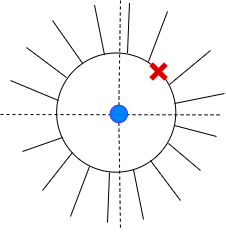
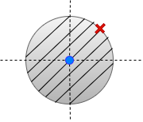
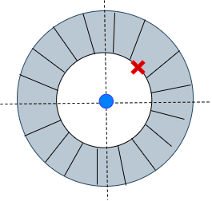

# $\text{z}$-transform #

The $z$- transform for a discrete-time signal $\text{x}[n]$ is given as:

$$ \text{X}(\text{z}) = \sum_{n=-\infty}^ {\infty} \text{x}[n]~ \text{z}^{-n} $$

where $\text{X}(\text{z})$ is a complex valued function of complex variable $\text{z}$.

$\text{z}$ transform always has two parts:

(i) Mathematical expression $\text{X}(\text{z})$

(ii) Region of convergence (ROC) - region in the complex $\text{z}$- plane where the sum $\text{X}(\text{z})$ converges.  

The region of convergence has radial symmetry. The ROC is always bounded by poles.

## Examples ##  

(i) Let $\text{x}[n]$ be $$\delta[n] = \left\{\begin{matrix}
1 \quad ~~~~~~n=0 \\
0 \quad \text{otherwise}
\end{matrix}\right.$$

The $\text{z}$- transform is given by,

$\text{X}(\text{z}) = \sum_{n=-\infty}^ {\infty} \text{x}[n]~ \text{z}^{-n} $

$~~~~~~~~~ = \sum_{n=-\infty}^ {\infty} \delta[n]~ \text{z}^{-n} $

$ ~~~~~~~~~= 1 $

ROC of $\delta[n]$ : complete $z$-plane

(ii) $\text{x}[n] = \delta[n-n_0]$, where $n_0 > 0$ and an integer

The $\text{z}$- transform is given as:

$\text{X}(\text{z}) = \sum_{n=-\infty}^ {\infty} \text{x}[n]~ \text{z}^{-n} $

$~~~~~~~~~ = \sum_{n=-\infty}^ {\infty} \delta[n-n_0]~ \text{z}^{-n}   $

$~~~~~~~~~   =  \text{z}^{-n_0}$

$~~~~~~~~~ = {\left ( \frac{1}{\text{z}} \right )}^{n_0}$

ROC: whole $\text{z}$-plane except $\text{z} = 0$

(iii) $\text{x}[n] = \delta[n+n_0]$, where $n_0 > 0$ and an integer  

The $\text{z}$- transform is given as:

$\text{X}(\text{z}) = \sum_{n=-\infty}^ {\infty} \text{x}[n]~ \text{z}^{-n} $

$~~~~~~~~~ = \sum_{n=-\infty}^ {\infty} \delta[n+n_0]~ \text{z}^{-n}  $

$~~~~~~~~~ =  \text{z}^{n_0}$ using shifting property of impulse signals

ROC: whole $\text{z}$-plane except $|\text{z}|=\infty$

## Poles and zeros ##

We are interested in $\text{z}$-transforms which are in the form of ratio of polynomials in $\text{z}$.

$$\text{X}(\text{z}) = \frac{N(\text{z})}{D(\text{z})} $$

Numerator $\text{N}(\text{z}) = 0$ provides zeros of $\text{X}(\text{z})$  

$$ \text{X}(\text{z}) = 0 $$

Denominator  $\text{D}(\text{z}) = 0$ provides poles of $\text{X}(\text{z})$

$$  \text{X}(\text{z}) = \infty $$

### Note ###

 1. Poles play an important role in deciding the ROC, zeros do not. The ROC can not contain any poles.

 2. Different time domain signals can have same $\text{z}$-transform expression $\text{X}(\text{z})$
 but with different ROC.  

 3. For the system to be causal, the ROC would be outside the outermost pole.

 4. For the system to be stable, the unit circle should be part of the ROC.

 5. For a system to be causal and stable, all the poles should be inside the unit circle.

## More examples ##

$1.~~\text{x}[n] = a^n u[n]$

$~~~~~\text{X}[\text{z}] = \sum_{n=-\infty}^ {\infty} x[n]~ \text{z}^{-n} $

$~~~~~\text{X}[\text{z}] = \sum_{n=-\infty}^ {\infty} a^n u[n] ~ \text{z}^{-n} $

$~~~~~\text{X}(\text{z})~ = ~\frac{\text{z}}{\text{z}-a} ~;$

$~~~~~\text{x}[n]$ is a causal signal i.e. $\text{x}[n] = 0$ for $n<0$

$~~~~~\text{ROC:} ~|\text{z}| > |a| $

$2.~~\text{x}[n] = -a^n u[-n-1]$

$~~~~~\text{X}[\text{z}] = \sum_{n=-\infty}^ {\infty} x[n]~ \text{z}^{-n} $

$~~~~~\text{X}[\text{z}] = \sum_{n=-\infty}^ {\infty} -a^n u[-n-1] ~ \text{z}^{-n} $

$~~~~~\text{X}(\text{z})~ = ~\frac{\text{z}}{\text{z}-a} ~;$

$~~~~~\text{x}[n]$ is a anti-causal signal i.e. $\text{x}[n] = 0$ for $n>0$

$~~~~~\text{ROC:} ~|\text{z}| < |a| $

$3.~~\text{x}[n] = b^n u[n] - a^n u[-n-1], |b| <|a|$

Using linearity of the Z-transform, from above examples we have

$~~~~~\text{X}(\text{z})~ = \frac{\text{z}}{\text{z}-b} + ~\frac{\text{z}}{\text{z}-a} ~;$

$~~~~~\text{ROC:} ~|b| < ~|\text{z}| < |a| $

